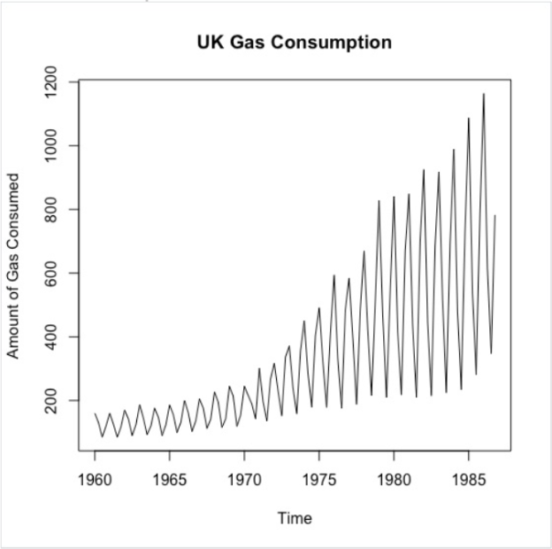
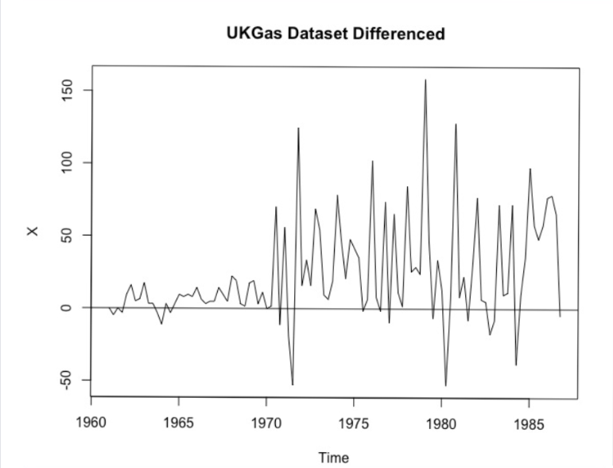
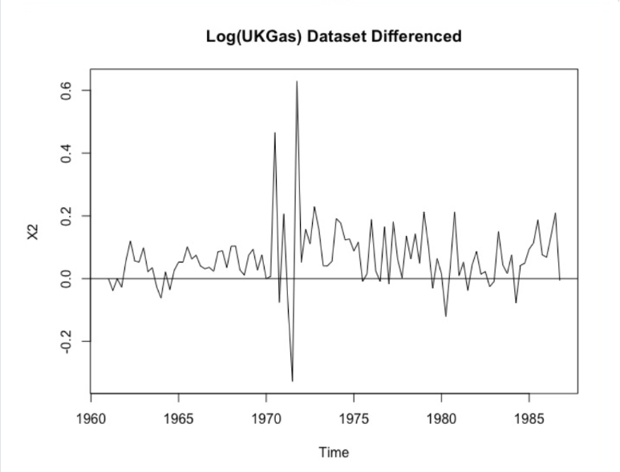
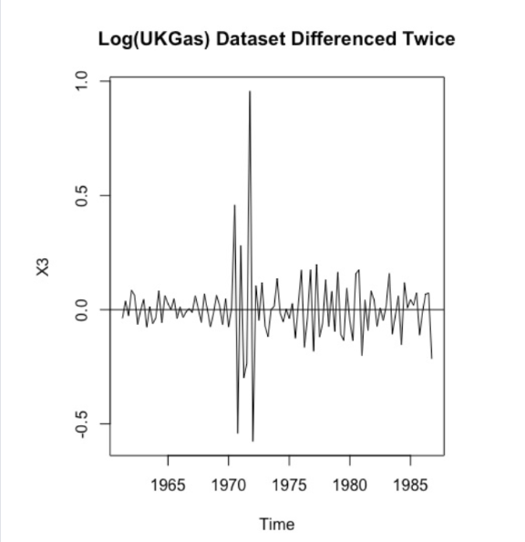
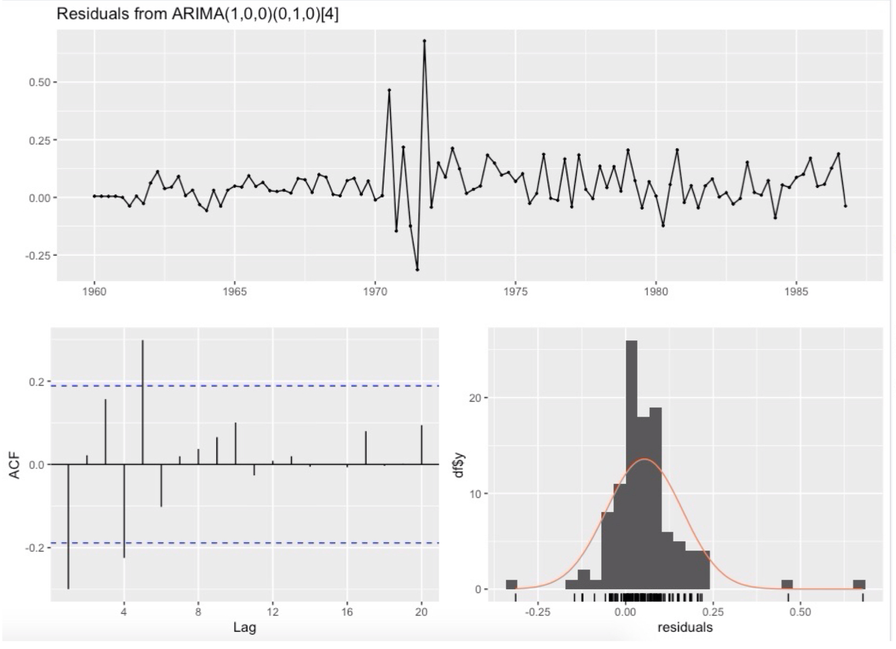
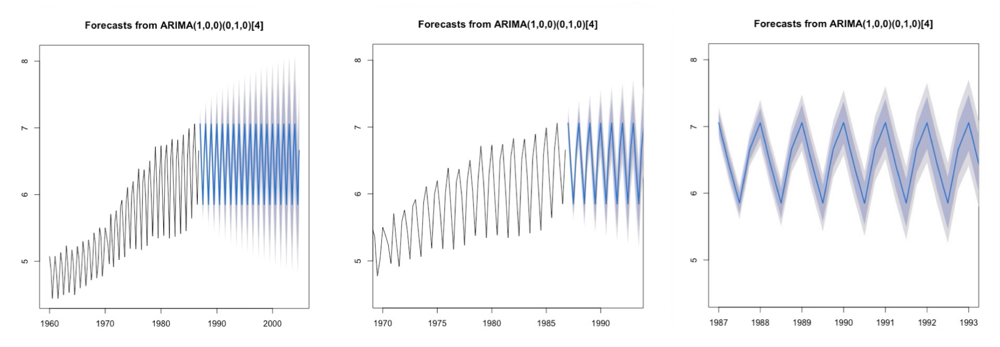

# Analysis of Time Series Dataset "UK Gas" (R)

**Mannat Kaur**  
**MATH 564 - Time Series - Illinois Tech**  
**Professor Leslie**

---

## Project Highlights

- Built a seasonal time-series forecasting model using SARIMA
- Captured quarterly gas demand patterns (1960–1987)
- Applied stationarity transformations and ADF testing
- Compared SARIMA with Holt–Winters exponential smoothing
- Generated 6-year (24-quarter) forecasts

## Impact

This project demonstrates how classical time-series methods translate raw national statistics into decision-ready forecasts. The workflow mirrors industry practice: clean → test stationarity → model → validate → communicate results.

## Skills

- R
- Time Series Analysis
- ARIMA/SARIMA
- Statistical Diagnostics
- Forecasting
- Data Visualization

## Table of Contents

- [Problem Context](#problem-context)
- [Data & Assumptions](#data--assumptions)
- [Methodology](#methodology)
- [Results](#results)
- [Impact](#impact)
- [Full R Code](#full-r-code)

---

## Problem Context

I developed a statistical forecasting model to analyze how UK gas demand evolved between 1960–1987, a period shaped by industrial expansion and changing household energy habits. The goal was to capture quarterly seasonal behavior and produce reliable multi-year forecasts that could support supply planning and infrastructure decisions.

---

## Data & Assumptions

Inputs consisted of the built-in UKgas quarterly dataset. The raw series showed:

- strong upward trend
- clear winter-summer seasonality
- increasing variance over time

External economic factors were not modeled so the focus remained on pure time-series structure.
### Raw Time Series

  

<em>Figure 1. Raw quarterly UK gas consumption series showing strong upward trend, pronounced seasonal fluctuations, and increasing variance over time.</em>

## Methodology

- Stabilized variance using log transformation
- Removed periodic behavior with lag-4 seasonal differencing
- Tested stationarity using Augmented Dickey–Fuller (ADF)
- Identified structure through ACF/PACF diagnostics
- Selected final model via auto.arima
- Benchmarked against Holt–Winters exponential smoothing
- Forecast horizon: 6 years (24 quarters)

### Step 1 — Seasonal Differencing

The first transformation removed quarterly seasonality from the raw series. While this reduced periodic structure, the series still showed unstable variance and was not yet fully stationary.

  

<em>Figure 2. UK Gas series after seasonal differencing (lag = 4).</em>

### Step 2 — Log Transformation + Seasonal Differencing

To stabilize the increasing variance, I applied a log transformation before differencing. This improved the spread of the series, but stationarity was still not fully achieved.

  

<em>Figure 3. Log-transformed UK Gas series after seasonal differencing.</em>

### Step 3 — Final Stationary Series

A second differencing step produced the final stationary series used for model identification. This version was suitable for ACF/PACF analysis and SARIMA fitting.

  

<em>Figure 4. Final stationary transformed series used for model estimation.</em>

---

## Results

- Final Model: **ARIMA(1,0,0)(0,1,0)[4]**
- Residuals behaved as white noise (Ljung–Box p > 0.05)
- Forecasts preserved realistic seasonal oscillations
- SARIMA and Holt–Winters produced consistent trends
- Model suitable for long-term demand planning

**Insight:**  
Energy demand is driven more by repeating human seasonal patterns than short-term noise; removing seasonality first was critical to reliable forecasts.

### Residual Diagnostics

Residual checks showed that the fitted model captured the main structure of the data well. The residual series behaved approximately like white noise, supporting the adequacy of the final SARIMA specification.

  

<em>Figure 5. Residual diagnostics for the final SARIMA model.</em>

### Forecast Output

The final model generated 24-quarter forecasts that preserved the strong recurring seasonal cycle seen in the historical series. Confidence intervals widened gradually while maintaining stable seasonal oscillations.

  

<em>Figure 6. Multi-year forecast from the final ARIMA(1,0,0)(0,1,0)[4] model.</em>

## Full R Code

All R code used in this analysis is included in the separate file:

**[View R Code](r-code.md)**

---
